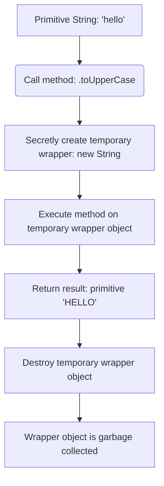

# String Autoboxing and Wrapper Objects

> **TL;DR:** Autoboxing is like temporarily placing a **plain letter** inside a **copy machine** (wrapper object) to run a function like uppercase printing. Once the copy is printed, the machine is immediately discarded, leaving you with the new printout; the original letter remains unchanged.

## The Mystery: Primitives Don't Have Methods
In JavaScript, strings are primitive values. By definition, primitives are simple data blocks and do not have properties or methods. However, this code works without errors:

```javascript
let str = "hello";
console.log(str.toUpperCase()); // "HELLO"
```

How can a primitive call `.toUpperCase()`? The answer is **autoboxing** (or boxing).

---

## The Autoboxing Mechanism Under the Hood
When you call a method or access a property on a primitive string, JavaScript secretly performs the following step-by-step lifecycle:



### Conceptual Code Equivalent
Behind the scenes, the expression `str.toUpperCase()` is handled similarly to:

```javascript
// 1. Temporary wrapper created
let temp = new String(str);

// 2. Method executed on the wrapper
let result = temp.toUpperCase();

// 3. Temporary wrapper discarded
temp = null; 

// 4. Result is returned
return result;
```
This entire process happens in milliseconds and is invisible to the developer.

---

## The Temporary Wrapper Trap: Custom Properties
Because wrapper objects are created and destroyed instantly, **primitives cannot permanently hold custom properties**.

Consider this famous interview question:
```javascript
let str = "javascript";
str.customProperty = "Hello";
console.log(str.customProperty); // What is the output?
```

### Why does it output `undefined`?
1. **Line 2 (`str.customProperty = "Hello"`)**: JavaScript sees property assignment on a primitive. It autoboxes `str` into a temporary `String` object, sets `customProperty = "Hello"`, and then immediately discards the temporary object.
2. **Line 3 (`console.log(str.customProperty)`)**: JavaScript tries to read `customProperty` from the primitive. It autoboxes `str` again, creating a **brand-new** temporary `String` object. This new object has no memory of the previous wrapper and thus returns `undefined`.

---

## Why Avoid `new String()`?
You can explicitly create a wrapper object using the `new String()` constructor. However, this is highly discouraged in real-world code for several reasons:

### 1. Type Differences
```javascript
let primitive = "hello";
let object = new String("hello");

console.log(typeof primitive); // "string"
console.log(typeof object);    // "object"
```

### 2. Equality Comparison Quirks
Explicit wrapper objects break logical comparisons:
* **Loose Equality (`==`)**: Performs type coercion, so it returns `true`.
  ```javascript
  console.log(primitive == object); // true
  ```
* **Strict Equality (`===`)**: Compares value AND type. Since one is a string and the other is an object, it returns `false`.
  ```javascript
  console.log(primitive === object); // false
  ```
* **Object-to-Object Comparison**: Two distinct objects are compared by reference, not content.
  ```javascript
  let obj1 = new String("hello");
  let obj2 = new String("hello");
  console.log(obj1 == obj2);  // false! (They point to different memory spots)
  console.log(obj1 === obj2); // false!
  ```

---

## Autoboxing Helpers: Object(str) vs. new String(str)
If you need to explicitly wrap a primitive, you can use the `Object()` function or `new String()`. The table below outlines how they differ:

| Expression | Result Type | Behavior |
| :--- | :---: | :--- |
| `"hello"` | `string` (primitive) | Raw text. Autoboxes temporarily on method invocation. |
| `new String("hello")` | `object` (wrapper) | Creates a fresh, permanent String object instance. |
| `Object("hello")` | `object` (wrapper) | Converts/coerces the primitive into its object wrapper equivalent. |

---

## Canonical Code Example

This copy-pasteable script tests and displays the behavior of autoboxing and comparisons:

```javascript
// --- 1. Autoboxing Property Disappearance ---
const theme = "dark-mode";

// Setting property on a primitive
theme.mode = "persistent"; // Fails silently (or throws TypeError in strict mode)
console.log("Primitive property:", theme.mode); // undefined


// --- 2. Permanent Object Wrapper Example ---
const persistentObj = new String("dark-mode");
persistentObj.mode = "persistent"; // Works, because it's a real object!
console.log("Object wrapper property:", persistentObj.mode); // "persistent"


// --- 3. Equality Behavior Check ---
const strLit = "code";
const strObj1 = new String("code");
const strObj2 = new String("code");
const coercedObj = Object(strLit);

console.log("Lit === Obj1:", strLit === strObj1); // false (string vs object)
console.log("Lit == Obj1:", strLit == strObj1);   // true (coercion converts Obj1 to primitive)
console.log("Obj1 == Obj2:", strObj1 == strObj2); // false (different object references)
console.log("typeof coercedObj:", typeof coercedObj); // "object"
console.log("coercedObj instanceof String:", coercedObj instanceof String); // true
```

---

## Related
* [[js-string-valueof-and-tostring]] - Extracting the primitive string value from wrapper objects.
* [[js-loose-equality-comaprison-rules]] - Understanding coercion in loose comparisons.
* [[js-strict-vs-loose-equality]] - Equality evaluations with reference types vs primitives.
* [[js-garbage-collection-mark-and-sweep]] - The lifecycle of discarded wrapper objects.
* [[MOC - JS Built-in Objects & Utilities]] - Hub for built-in wrappers.
