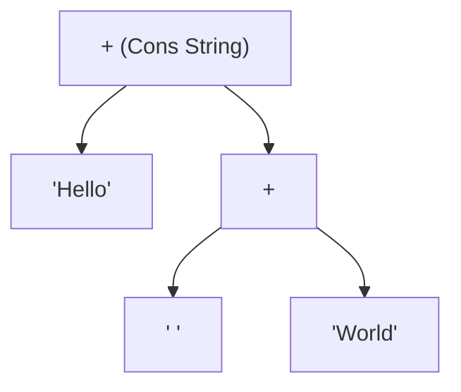

# String Concatenation: concat vs Operators

> **TL;DR:** **concat()** is like a **glue stick** (it takes multiple independent strings and glues them together into a new, longer string, leaving the original pieces completely intact).

## Purpose & Behavior
The `concat()` method combines the text of two or more strings and returns a new string. It does not modify the original strings.

```javascript
string.concat(str1, str2, ..., strN)
```

---

## Technical Details & Mechanics

### 1. Primitive Immutability
Because JavaScript strings are [[js-string-immutability|immutable]], concatenation never extends an existing string in memory. Instead, the engine:
1. Reads the character code units of the source strings.
2. Allocates new memory space.
3. Copies all characters into the new block.
4. Returns a new primitive string.

### 2. How Modern Engines Optimize: Rope Strings (Cons Strings)
Naively copying characters for every join (e.g., `a + b + c + d`) would require repeated copying operations, resulting in a time complexity of $O(n^2)$. 

To prevent this, modern engines like **V8** (Chrome/Node.js) optimize concatenation using a data structure called a **Rope String** (or **Cons String**):
* **The Rope Structure:** Instead of copying characters immediately, the engine represents the combined string as a **binary tree** where parent nodes represent joins, and leaf nodes contain references to the actual string slices in memory.
* **Lazy Flattening:** No copying happens during intermediate joins. The engine only flattens the tree into a single contiguous flat string when the final text is actually needed (e.g., printed to the console or sent to an API).



---

## Which Should You Use?

In modern JavaScript, there are three ways to combine strings:

1. **`concat()` method:** `first.concat(" ", last)`
2. **`+` operator:** `first + " " + last`
3. **Template Literals:** `` `${first} ${last}` ``

### The Recommendation
Modern developers almost always prefer **Template Literals** or the **`+` operator** over `concat()`. 
* **Readability:** Template literals are highly expressive, especially for complex string patterns.
* **Performance:** Modern engines apply the same Rope String optimizations to all three options, meaning performance differences are negligible.

> [!TIP]
> For building huge reports (e.g., 1 million lines) inside loops, accumulating strings in an array and calling `array.join("\n")` is still preferred. It avoids relying on engine-specific heuristics and reduces overall memory allocations. For small to medium loops (under 5,000 lines), standard `+=` operations are perfectly acceptable.

---

## Canonical Code Example

Here is a copy-pasteable script highlighting performance patterns, V8 rope optimizations, and syntax comparisons:

```javascript
// --- 1. Syntax Comparisons ---
const name = "Luffy";
const age = 20;

// Method A: concat
console.log("concat():", "Name: ".concat(name, " Age: ", age));

// Method B: + Operator
console.log("+ Operator:", "Name: " + name + " Age: " + age);

// Method C: Template Literals (Preferred)
console.log("Template Literal:", `Name: ${name} Age: ${age}`);


// --- 2. String Accumulation in Loops ---
// Large-scale report building (10,000 rows)
const rows = Array(10000).fill("Row Data");

// Performance option for huge datasets: Array pushing + join
const reportArray = [];
for (const row of rows) {
  reportArray.push(row);
}
const finalReport = reportArray.join("\n");
console.log("Joined report length:", finalReport.length);


// --- 3. Coercion & Immutability quirks ---
let greeting = "Hello";
greeting.concat(" World"); // Returns "Hello World", but result is ignored!
console.log("Original remains unmutated:", greeting); // "Hello"

// Arguments are automatically coerced to strings
const result = "".concat(123, true, { toString: () => " [Object]" });
console.log("Coerced concatenation:", result); // "123true [Object]"
```

---

## Related
* [[js-string-immutability]] - Exploring why strings cannot be modified in place.
* [[js-template-literals-and-tagged-templates]] - Expressive string interpolation.
* [[js-string-memory-storage]] - Low-level storage and V8 allocation limits.
* [[MOC - JS Data Types & Memory]] - Memory stack vs heap behavior for primitives.
* [[MOC - JS Built-in Objects & Utilities]] - Central directory for utility methods.
