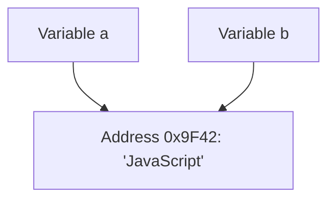
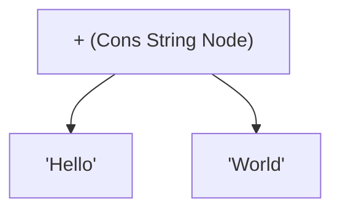

# JavaScript String Memory Storage & Interning

> **TL;DR:** String interning is like a **public library** keeping only **one copy of a book** on the shelf, even if 100 people are currently borrowing and reading it. Since the book is read-only (immutable), readers can safely share the single physical copy without worrying that someone else will erase or edit the pages.

## Debunking the Myth: "Primitives on Stack, Objects on Heap"
Many tutorials claim that all primitives reside on the Call Stack while objects reside on the Memory Heap. This is a massive oversimplification. 

* **The Specification (ECMAScript)**: Defines **observable behavior**, not hardware-level memory layouts. It never dictates stack vs heap usage.
* **The Engine (e.g., V8)**: Decides where values live. In practice, long strings and strings declared within closures are commonly stored on the heap. Variables on the stack simply hold pointers to these values.

---

## 1. String Sharing (Memory Ref Sharing)
When you assign one string variable to another, JavaScript does not copy the underlying text in memory. It simply makes both variables point to the same immutable memory storage.

```javascript
let a = "JavaScript";
let b = a; // No new string allocated in memory!
```



If you reassign `b = "Python"`, the engine doesn't mutate `"JavaScript"`. It allocates `"Python"` at a new address and shifts the pointer for `b`. This is highly efficient and perfectly safe **only because strings are immutable**.

---

## 2. String Interning
**String Interning** is an engine-level optimization where identical string literals are stored only once in a central lookup table (the "string pool").

```javascript
let a = "cat";
let b = "cat";
let c = "cat";
// V8 stores exactly one copy of "cat" and shares it across all three variables.
```

### Benefits of Interning:
1. **Saves RAM**: Prevents duplicate allocations for common keywords, property names, and literals.
2. **O(1) Equality Checks**: If two strings share the exact same memory pointer, the engine instantly knows they are equal without comparing their contents character-by-character.
3. **Better Cache Performance**: Keeps the working memory footprint small.

> [!WARNING]
> **Interning is an implementation detail.** ECMAScript does not guarantee it. V8 (Chrome/Node.js), SpiderMonkey (Firefox), and JavaScriptCore (Safari) handle interning differently. Never write code that relies on memory pointer identity for logical outcomes.

---

## 3. Rope Strings (Cons Strings)
When you concatenate strings, creating a new, contiguous memory block immediately is very expensive.

```javascript
let first = "Hello";
let second = "World";
let result = first + second;
```

To avoid repeated copying, modern JS engines represent concatenated strings using a binary tree structure called a **Rope String** (or **Cons String** in V8):



The engine postpones the actual joining (flattening) of the string until it is absolutely necessary (e.g., when passing it to an API or performing regex checks). This turns $O(N)$ string copying costs into $O(1)$ node-link operations.

---

## Canonical Code Example

The script below demonstrates how memory sharing and concatenation trees function conceptually:

```javascript
// --- 1. Literal Pointer Comparison (Conceptual Interning) ---
const firstStr = "apple";
const secondStr = "apple";

// Both variables hold the same primitive value.
// Internally, V8 points them to the same memory reference.
console.log("Value Equality:", firstStr === secondStr); // true


// --- 2. String Interning Interview Edge Case ---
// Concatenated dynamic strings might NOT be automatically interned initially.
const part1 = "ap";
const part2 = "ple";
const dynamicStr = part1 + part2; // Creates a Cons String (Rope)

console.log("Dynamically built equal to literal?:", dynamicStr === firstStr); // true
// Note: While true at the language layer, internally they may occupy 
// different structures (Cons String vs. Flat String) until flattened.


// --- 3. Concatenation Loop Performance Trap ---
// Repeated concatenation in loops can build deep, bloated Rope Trees.
console.time("Loop Concatenation");
let text = "";
for (let i = 0; i < 50000; i++) {
  text += "a"; // Builds a chain of 50,000 tree nodes
}
// Flattening the rope: accessing length forces the engine to resolve the tree
const totalLen = text.length; 
console.timeEnd("Loop Concatenation");
console.log("Total character count:", totalLen);
```

---

## Related
* [[js-garbage-collection-mark-and-sweep]] - How reclaimed string nodes are cleared.
* [[js-string-immutability]] - Why memory optimizations are safe due to read-only semantics.
* [[js-primitive-vs-reference-types]] - Comparing primitive memory copy to object reference copy.
* [[MOC - JS Data Types & Memory]] - Master hub for JavaScript storage and memory systems.
